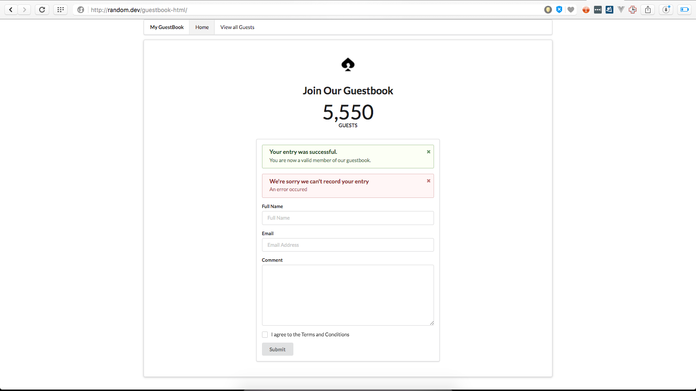
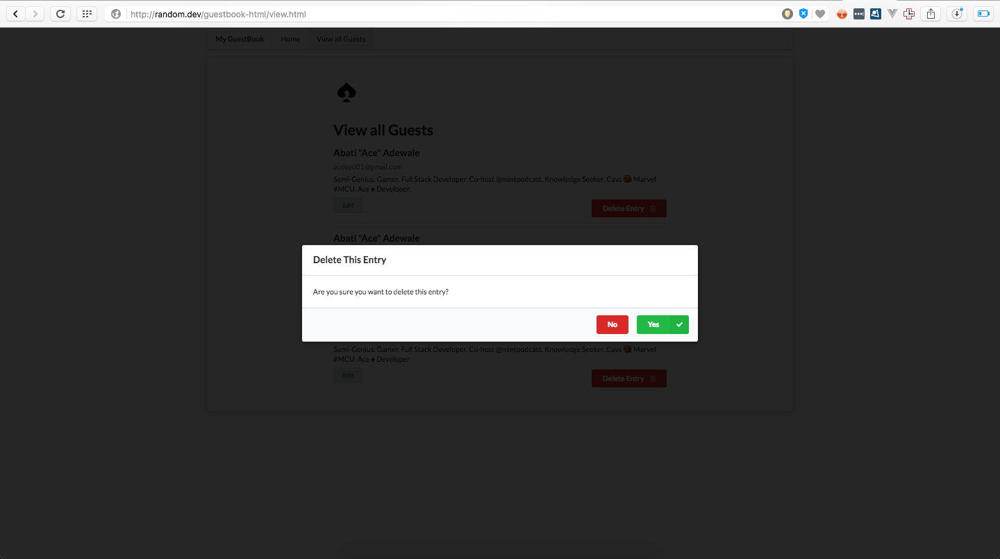
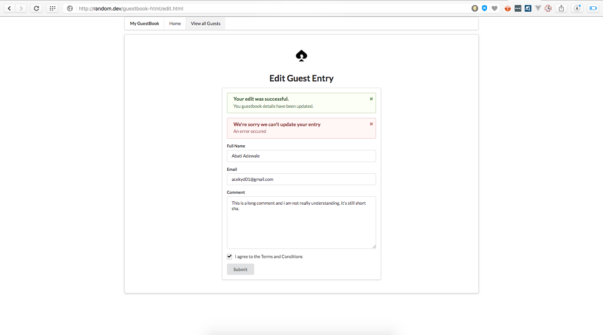

#Guestbook Html Boilerplate withou any external front end framework

It's simple. Learning a new tool or backend app?? Or trying out an app in this article -> [5 Web Project ideas to test your new coding skills](https://medium.com/@AceKYD/5-web-project-ideas-to-test-your-new-coding-skills-91a18f6a0d5c#.w2lza0xgb). 

This boilerplate helps you focus on the backend tool or web project you are trying to build instead of getting hung up on the details. Forget worries about how it looks or same old HTML that you already know and focus on what you are trying to learn.

Why Guestbook Html Boilerplate? Aren't you tired of building Todo apps already?? LOL

Built with Semantic UI - http://www.semantic-ui.com for frontend.

##Screenshots 

